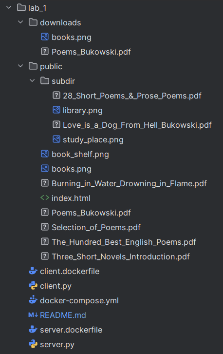
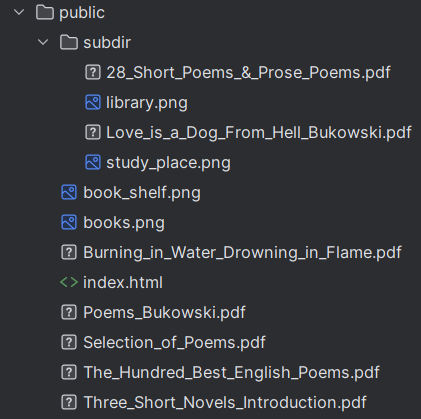
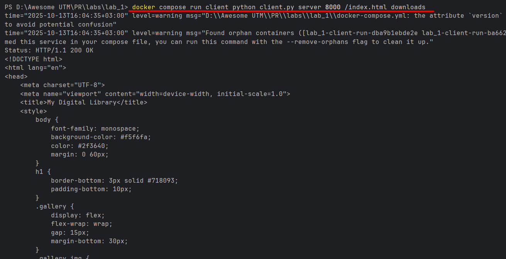
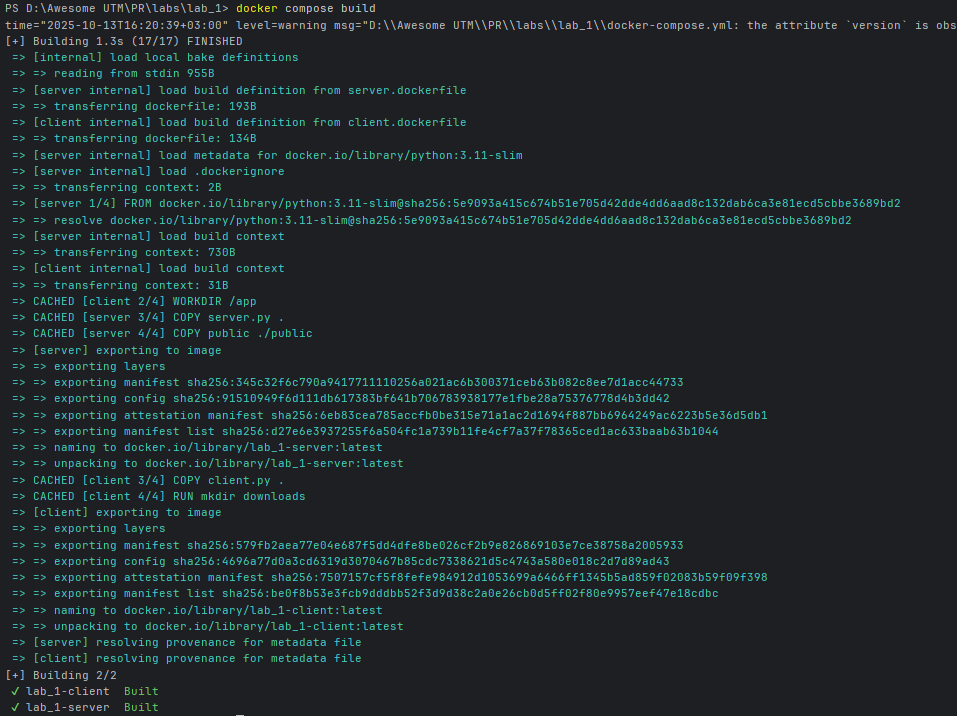
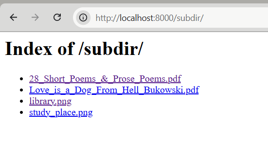
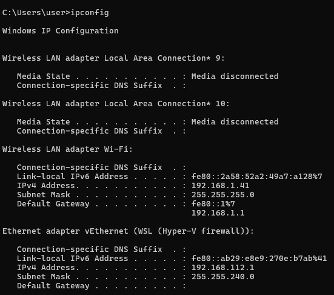

# Lab 1: HTTP File Server with TCP Sockets

Author: Madalina Chirpicinic, FAF-233

## 1. Introduction
This laboratory work implements a simple HTTP file server using Python sockets and Docker Compose. The server allows clients to browse and download files from a specified directory, including HTML pages, PNG images, and PDFs. I also created a Python client to request files from the server, demonstrating both file serving and downloading functionality in a controlled network environment.

## 2. Source Directory Contents
My source directory structure (./lab_1) has several key elements:
* downloads -- directory for storing all the client's downloaded content from the server
* public -- directory with all the content to be served from the server to the client
  * .html files
  * .pdf files
  * .png files
  * subdirectory /subdir (with similar file types inside)
* screenshots -- directory with screenshots used in the report
* client.py, server.py -- implementations for the HTTP client and server in Python
* client.dockerfile, server.dockerfile -- dockerized client / server
* docker-compose.yml -- file for Docker Compose
* README.md -- laboratory report

Below you can see a visual representation of my source directory contents:


## 3. Docker containerization
* client.dockerfile
```dockerfile
FROM python:3.11-slim
WORKDIR /app
COPY client.py .
RUN mkdir downloads
CMD ["bash"]
```
* server.dockerfile
```dockerfile
FROM python:3.11-slim
WORKDIR /app
COPY server.py .
COPY public ./public
EXPOSE 8000
CMD ["python", "server.py", "./public", "8000"]
```
* docker-compose.yaml
```dockerfile
version: "3.9"
services:
  server:
    build:
      context: .
      dockerfile: server.dockerfile
    ports:
      - "8000:8000"
    volumes:
      - ./public:/app/public
  client:
    build:
      context: .
      dockerfile: client.dockerfile
    volumes:
      - ./downloads:/app/downloads
```
## 4. Starting the Containers

The following commands will:
1. Build the images
2. Run the server in detached mode
3. Run the client to download a file

```bash
docker compose build
docker compose up -d server
docker compose run client python client.py server 8000 /Three_Short_Novels_Introduction.pdf downloads
```

## 5. Running the Server Inside the Container
* this command will start a new container for the `server` service defined in `docker-compose.yml`: 
```bash
docker compose run server
```
* this command will run the server script inside the container, serving the `./served_content` directory on port `8000`:
```bash
python server.py ./served_content 8000
```

## 6. Contents of the served directory
The served directory `/public` has the following contents:
* /subdir
  * .pdf file 
  * .png file 
  * .pdf file 
  * .png file 
* .png file
* .png file
* .pdf file
* .html file
* .pdf file
* .pdf file
* .pdf file
* .pdf file

This could be also shown in the image below:



## 7. 4-cases: file requests in the browser
1. HTML file with image

2. PDF file

5. PNG file


4. Inexistent file (404)


## 8. Client Script - demonstration
The command used to run the client is:
```bash
docker compose up client
```
and then to execute a specific task:
```bash
docker compose run client python client.py server 8000 /Three_Short_Novels_Introduction.pdf downloads
```

Below, a representation of the logs from starting the docker containers is shown:



## 9. Directory listing - demonstration
Below is a representation of the main page of the server with .html, .png, and .pdf files to be served:

When you click to the subdirectory, you are redirected to such a page with the subdirectory's contents:


## 10. Browsing a friend's server

For the purpose of this explanation, I will use the following terms:
* Computer 1 - my computer
* Computer 2 - my friend's computer

Firstly, I have opened a terminal on Computer 1 and wrote the following command prompt `cmd` in order to get the `IPv4` address:
```
ipconfig
```
and obtained it (192.168.1.41):


Secondly, I have connected Computer 2 to the same Wi-Fi (therefore both belong to the same local network)

Then, I run the following command on Computer 1 to start teh server and open the web socket:
```bash
python3 server.py ./public 8000 
```


Computer 2 was easily able to connect to `http:\\192.168.1.41:8000` and open / download files from the server:


