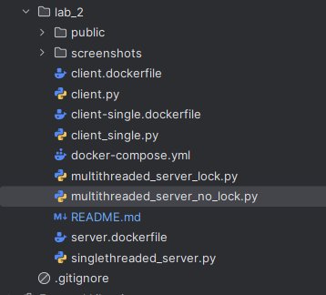
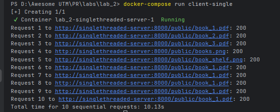

# Lab 2: Concurrent HTTP server. Implementation of multithreading

Author: Madalina Chirpicinic, FAF-233

## 1. Introduction
This laboratory work implements a concurrent HTTP server (with multithreading) for 2 cases:

- race condition present
- handling of race condition via a thread lock 

To compare how multithreading works in terms of time, a singlethreaded server was also implemented and their times in both cases was compared for handling 10 requests.
The servers have a RATE_LIMIT=5 (requests / second) and are programmed to handle a request in 1 second.
The respective client scripts for singlethreaded / multithreaded servers were also implemented.

## 2. Source Directory Contents
My source directory structure (./lab_2) has several key elements:

### server scripts
- singlethreaded_server.py
  - handles one request at a time and measures time of execution of sent requests
- multithreaded_server_no_lock.py
  - server that implements multithreading, has RATE_LIMIT=5, and has NO handling of race condiiton (no thread locks)
- multithreaded_server_lock.py
  - same as previously but implements thread locks and handles the race condition

### client scripts
- client.py
  - client script for multithreaded servers
- client-single.py
  - client script for singlethreaded server

### docker files
- client.dockerfile
- client-single.dockerfile
- server.dockerfile
- docker-compose.yml 



## 3. Docker containerization
* client.dockerfile
```dockerfile
FROM python:3.9-slim
WORKDIR /app
COPY client.py .
COPY client_single.py .
RUN pip install requests
CMD ["python", "client.py"]
```

* client-single.dockerfile
```dockerfile
FROM python:3.12-slim
WORKDIR /app
COPY client_single.py .
RUN pip install requests
CMD ["python", "client_singlethreaded.py"]
```

* server.dockerfile
```dockerfile
FROM python:3.9-slim
WORKDIR /app
COPY multithreaded_server_lock.py .
COPY multithreaded_server_no_lock.py .
COPY singlethreaded_server.py .
COPY public/ ./public/
EXPOSE 8000
CMD ["python", "singlethreaded_server.py"]
```

* docker-compose.yaml
```dockerfile
version: "3.9"

services:
  singlethreaded-server:
    build:
      context: .
      dockerfile: server.dockerfile
    ports:
      - "8000:8000"
    command: ["python", "singlethreaded_server.py"]
    networks:
      - app-network

  multithreaded-lock-server:
    build:
      context: .
      dockerfile: server.dockerfile
    ports:
      - "8001:8001"
    command: ["python", "multithreaded_server_lock.py"]
    networks:
      - app-network

  multithreaded-nolock-server:
    build:
      context: .
      dockerfile: server.dockerfile
    ports:
      - "8002:8002"
    command: ["python", "multithreaded_server_no_lock.py"]
    networks:
      - app-network

  client-nolock:
    build:
      context: .
      dockerfile: client.dockerfile
    image: client-nolock
    command: ["python", "client.py"]
    depends_on:
      - multithreaded-nolock-server
    environment:
      - SERVER_HOST=multithreaded-nolock-server
      - SERVER_PORT=8002
    networks:
      - app-network

  client-lock:
    build:
      context: .
      dockerfile: client.dockerfile
    image: client-lock
    command: [ "python", "client.py" ]
    depends_on:
      - multithreaded-lock-server
    environment:
      - SERVER_HOST=multithreaded-lock-server
      - SERVER_PORT=8001
    networks:
      - app-network

  client-single:
    build:
      context: .
      dockerfile: client.dockerfile
    image: client-single
    command: ["python", "client_single.py"]
    depends_on:
      - singlethreaded-server
    environment:
      - SERVER_HOST=singlethreaded-server
      - SERVER_PORT=8000
    networks:
      - app-network

networks:
  app-network:
    driver: bridge
```

## 4. Starting the Containers

The following commands will:
1. Build the images
2. Run the server container 
3. Run the client container

```dockerfile
docker-compose build
docker-compose up [server_container_name]
docker-compose run [client_container_name]
```
For specific commands for running servers and clients in different use-cases, please see the section below.

## 5. Demo with running the containers and all scenarios

### Build images from dockerfiles:
```bash
docker-compose build
```


***

### Case 1: Singlethreaded server
#### 1. start the server 
```bash
docker-compose up singlethreaded-server
```
#### 2. run client 
```bash
docker-compose run client-single
```

The client sends 10 requests of 1 second each, the server executes them one by one.
The total time for 10 sequential requests: 10.13 s.



***


### Case 2: Multithreaded server WITH race condition
#### 1. start the server
```bash
docker-compose up multithreaded-nolock-server
```
#### 2. run client
```bash
docker-compose run client-nolock
```
The client sends 10 simultaneous requests using a thread pool. The server (with a limit of 5 requests per second) accepts 5 and rejects 5.
A time.sleep(0.01) is added to show that a race condition is presents (as shown in the image below): 4 requests are calculated with the counter instead of 5.


### Case 3: Multithreaded server WITHOUT race condition
***
#### 1. start the server
```bash
docker-compose up multithreaded-lock-server
```
#### 2. run client
```bash
docker-compose run client-lock
```
Thread locks are added to the server which, as it can be seen in the image below, eliminate the race condition, 5 requests are correctly recorded.


## 6. Rate limiting
In order to implement rate limiting, the follow implementation was made:

Inside the multithreaded server scripts, the following implementations were made:

#### data structure to track requests per IP:
```python
rate_limit_dict = defaultdict(list)
rate_lock = threading.Lock()
RATE_LIMIT = 5
```
#### check and enforce rate limit in do_GET:
```python
with rate_lock:
    now = time.time()
    timestamps = rate_limit_dict[client_ip]
    timestamps = [t for t in timestamps if now - t < 1]  
    if len(timestamps) >= RATE_LIMIT:
        self.send_response(429)
        self.end_headers()
        self.wfile.write(b"Rate limit exceeded\n")
        return
    timestamps.append(now)
    rate_limit_dict[client_ip] = timestamps

```


## 7. Thread locks in python
In order to elimiante race conditions in multithread serser, a lock on the threads can be used.

A lock is a synchronization primitive that can be used for exclusive access to a resource. Once a thread acquires a lock, no other threads can acquire it and proceed until the lock is released. 

Inside the multithreaded_server_lock.py, the following implementations were made:

#### definition of locks:
```python
request_counter = defaultdict(int)
counter_lock = threading.Lock()
rate_limit_dict = defaultdict(list)
rate_lock = threading.Lock()
```

#### lock usage for rate limiting:
```python
with rate_lock:
    now = time.time()
    timestamps = rate_limit_dict[client_ip]
    timestamps = [t for t in timestamps if now - t < 1]
    if len(timestamps) >= RATE_LIMIT:
        self.send_response(429)
        self.end_headers()
        self.wfile.write(b"Rate limit exceeded\n")
        return
    timestamps.append(now)
    rate_limit_dict[client_ip] = timestamps
```

#### lock usage for request counting:
```python
with counter_lock:
    request_counter[self.path] += 1
```
