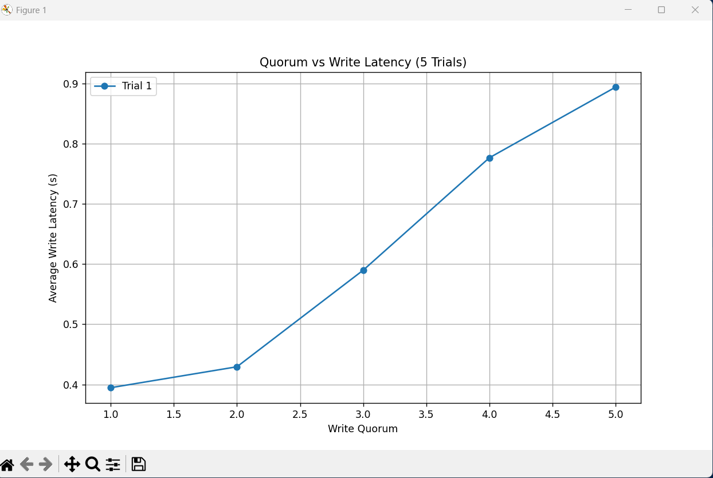

Testing project without docker:

leader:
```powershell
$env:FOLLOWERS="http://localhost:8001,http://localhost:8002,http://localhost:8003,http://localhost:8004,http://localhost:8005"
$env:WRITE_QUORUM="3"
$env:MIN_DELAY="0"
$env:MAX_DELAY="1000"

python -m fastapi run leader.py --port 8000 
```

followers:
for 8001 to 8005:
```bash
python -m hypercorn follower:app --bind 0.0.0.0:8002
```


Command for checking value of a local env:
```powershell
$Env:MAX_DELAY
```


In order to run with docker:
```docker
docker-compose build 
docker-compose up
```


Screenshot with the plotter graph:
